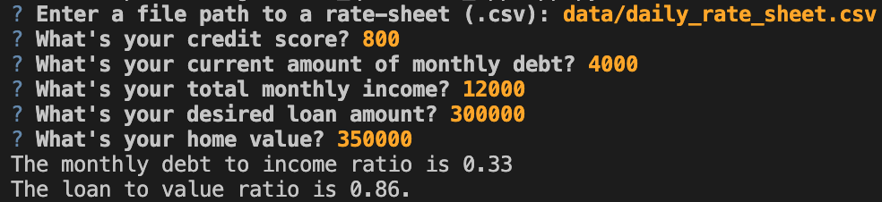
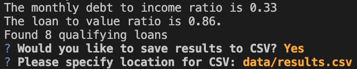

# Project Title

The Loan Qualifer App is a command-line interface application, written in Python, designed to help users quickly find qualifying loans against a list located in 'daily_rate_sheet'.  The app will take user data and determine eligibility and return a list of loans that the user qualifies for and give them the option to save a spreadsheet to share with their colleagues.

---

## Technologies

This project leverages python 3.7 with the following libraries:

* [fire](https://github.com/google/python-fire) - For the command line interface, 

* [questionary](https://github.com/tmbo/questionary) - For interactive user prompts and dialogs

---

## Installation Guide

Before running the application, the following dependencies must be installed

'''
python
pip install fire
pip install questionary
'''

---

## Usage

The application will prompt the user for the following:
**File Path, Credit Score, Debt, Income, Loan, LTV**

The application will calculate and display the following:
**DTI, LTV and number of qualified loans**

The app then gives the user option to save to CSV:

---

## Contributors

Dan Herman
ET Home Loans
---

## License

MIT
